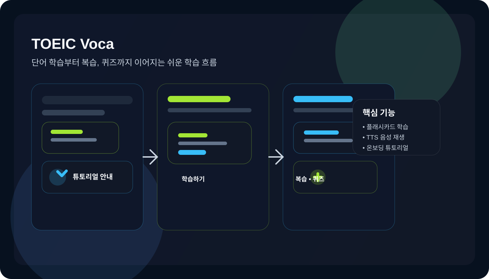

# TOEIC Voca

TOEIC 영단어 학습을 위한 Next.js 기반 웹 애플리케이션입니다. 단어 학습, 복습, 퀴즈, 대시보드, 설정 기능을 하나의 흐름으로 제공하며, TTS 재생과 Supabase 연동을 지원합니다.

## 프로젝트 소개

이 서비스는 TOEIC 시험 준비를 위한 영단어 학습 앱으로, 사용자가 단어를 쉽고 반복적으로 익힐 수 있도록 설계되었습니다.

아래 이미지는 앱의 주요 학습 흐름과 온보딩 튜토리얼 경험을 한눈에 보여줍니다.



이 프로젝트는 다음과 같은 흐름으로 사용됩니다.

- 단어 학습: 플래시카드 형태로 단어를 학습합니다.
- 복습: 학습 상태에 따라 단어를 다시 확인합니다.
- 퀴즈: 퀴즈 형식으로 이해도를 점검합니다.
- 통계/대시보드: 학습 진행 상황을 확인합니다.
- 설정: 사용자 환경에 맞게 앱 설정을 조정합니다.

## 기술 스택

이 프로젝트는 TOEIC 영단어 학습 서비스에 적합하도록 다음 기술을 사용합니다.

- Frontend: Next.js 16, React 19, TypeScript
- Styling: Tailwind CSS
- State Management: Zustand
- Animation: Framer Motion
- Data Processing: PapaParse
- Backend/Database: Supabase SSR
- UI Icons: lucide-react

## 프로젝트 구조

```text
src/
  app/                # Next.js App Router 페이지 및 API 라우트
    api/tts/          # TTS API 엔드포인트
    category/         # 카테고리 페이지
    dashboard/        # 대시보드 페이지
    quiz/             # 퀴즈 페이지
    review/           # 복습 페이지
    settings/         # 설정 페이지
    study/            # 학습 페이지
    vocabs/           # 단어 목록 페이지
  components/         # UI 컴포넌트
  data/               # 단어 JSON / CSV 데이터
  hooks/              # 커스텀 훅
  store/              # Zustand 상태 관리
  utils/              # 유틸리티 및 Supabase 설정
```

## 실행 방법

### 1) 의존성 설치

```bash
npm install
```

### 2) 환경 변수 설정

프로젝트 루트에 `.env.local` 파일을 생성하고, Supabase 관련 값을 설정합니다.

```env
NEXT_PUBLIC_SUPABASE_URL=your_supabase_url
NEXT_PUBLIC_SUPABASE_ANON_KEY=your_supabase_anon_key
```

### 3) 개발 서버 실행

```bash
npm run dev
```

브라우저에서 http://localhost:3000 으로 접속합니다.

## 빌드

```bash
npm run build
npm run start
```

## 온보딩 튜토리얼

처음 앱을 사용하는 사용자를 위해 대시보드와 학습 화면에 컨텍스트형 튜토리얼이 포함되어 있습니다.

- 대시보드에서는 학습 성취도 카드와 학습 모드 선택 안내를 보여줍니다.
- 학습 화면에서는 카드 터치/스와이프, 학습 상태 저장 방식에 대한 안내를 보여줍니다.
- 튜토리얼은 사용자가 한 번 확인하면 로컬 저장소에 기록되어 이후에는 다시 노출되지 않습니다.

## 참고 사항

- 기본 진입 페이지는 설정 페이지로 리다이렉트됩니다.
- 단어 데이터는 `src/data` 폴더의 JSON/CSV 파일을 기준으로 구성되어 있습니다.
- TTS 기능은 `src/app/api/tts/route.ts`에서 처리됩니다.
